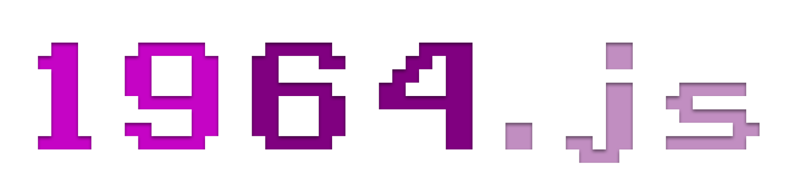
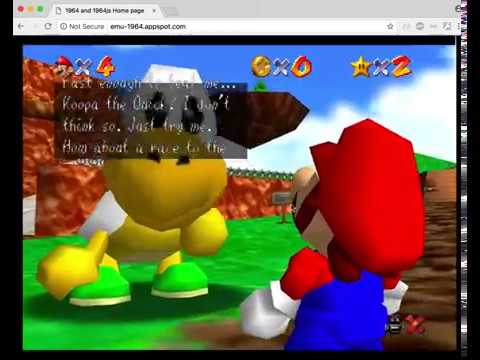

# 1964.js

This is the first Nintendo 64 emulator written in JavaScript.
## Features

- Runs some commercial games, as well as some homebrew and test ROMs
- Works in any modern browser

## Screenshots


## Tech used

JavaScript Libraries:

- BigInt.js, bitjs, GL Matrix, Google Closure, WebGL Utilities

Other:

- Ruby, Slim, Sass, CoffeeScript, CoffeeLint, NodeJS, NPM, JavaScript, Java, HTML
## Installation

Build 1964.js on Linux/Mac:

```bash  
sudo apt-get install ruby
sudo gem install slim
sudo gem install sass
sudo gem install coffeelint
sudo apt-get install nodejs
sudo apt-get install nodejs-legacy
sudo apt-get install npm
sudo npm install -g coffeescript
sudo npm install -g coffeelint
Run compile.sh
```

Build 1964.js on Windows:

```bash
Install MinGW/MSYS/Cygwin/WSL terminal
Install Ruby
Install Slim
Install Sass
Install CoffeeLint
Install CoffeeScript
Install NodeJS
Install NPM
Install Java
Run compile.sh in terminal
```
## License

- [GNU GPLv2](https://choosealicense.com/licenses/gpl-2.0/)

## Authors

- [Schibo](https://github.com/schibo)

## Contributors

- [Derek "Turtle" Roe](https://github.com/derekturtleroe)
## Related

Be sure to check out n64js as well!

[n64js](http://hulkholden.github.com/n64js)

Greets to StrmnNrmn, author of n64js and Daedalus! Coincidentally, we started JavaScript N64 emulators around the same time!